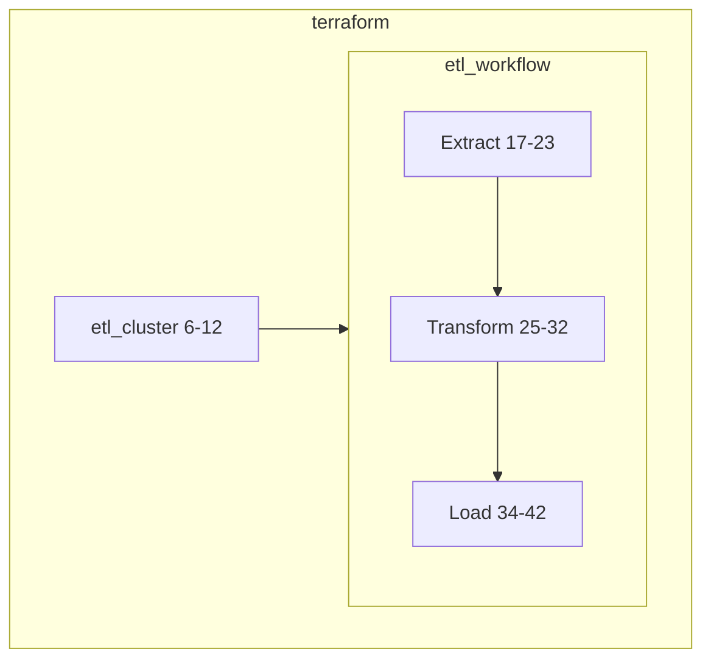

# StudentWorker
python scripts I wrote for Dr. Citurs to find eligible students for classes with course logic

# Example mermaid chat (i'm just testing something out)

```mermaid
flowchart
    subgraph terraform 
        subgraph etl_workflow
            etl_workflow_Extract[Extract 17-23]
            etl_workflow_Transform[Transform 25-32]
            etl_workflow_Extract --> etl_workflow_Transform
            etl_workflow_Load[Load 34-42]
            etl_workflow_Transform --> etl_workflow_Load
        end
    cluster_etl_cluster[etl_cluster 6-12] --> etl_workflow
    click C call callback() "Tooltip for a callback"
    end
    click etl_workflow_Extract href "https://github.com/amplify-education/python-hcl2/blob/main/hcl2/transformer.py#L15-L16" "This is a tooltip for a link"
    click cluster_etl_cluster call callback() "Tooltip for a callback"

```
